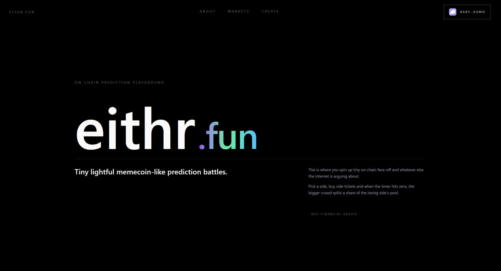
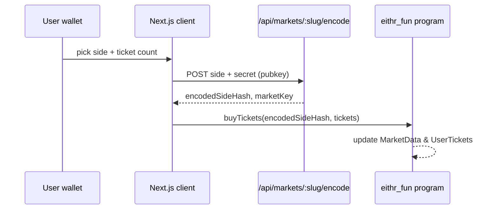
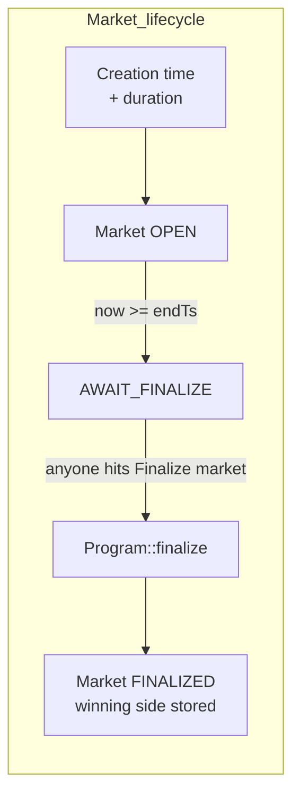
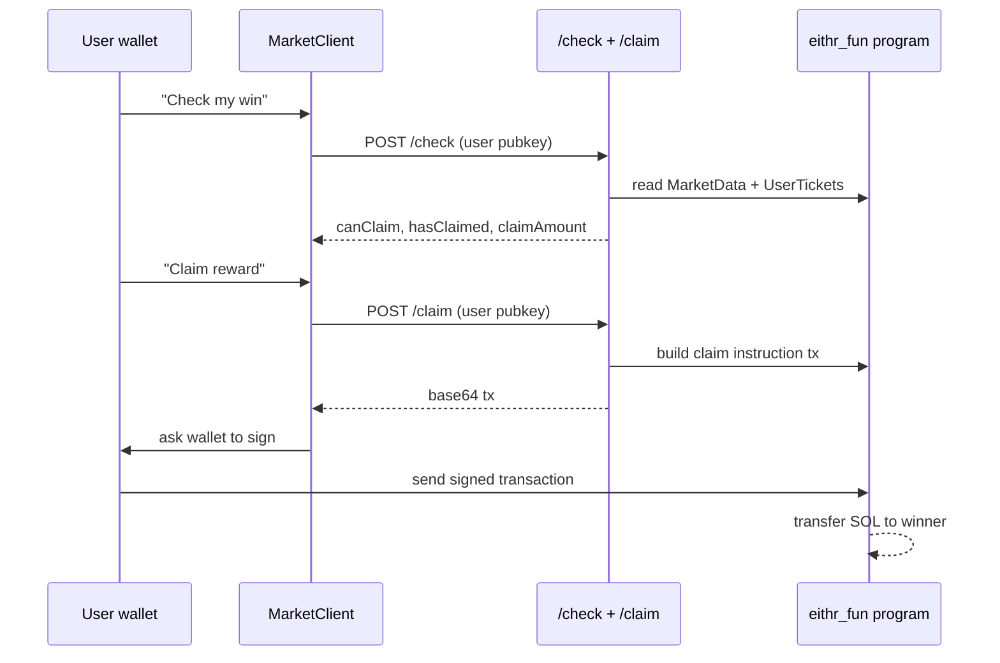

# eithr.fun · on-chain prediction playground

> Tiny, memecoin-like prediction battles that spin up and settle in minutes - not months.



---

<p align="center">
  <b>On-chain prediction playground for the stuff the internet is already fighting about.</b>
  <br/>
  Spin up a tiny market, pick a side, buy tickets, let the timer hit zero,<br/>
  and let the chain decide who gets the SOL.
</p>

<p align="center">
  <a href="https://www.eithr.fun/markets">Live demo</a> ·
  <a href="https://www.youtube.com/watch?v=HH1tiyQCYSI">Video</a> ·
  <a href="#features">Features</a> ·
  <a href="#dev-setup">Dev setup</a> ·
</p>

---

## TL;DR

* ⚡ **Fast markets** - minutes or hours, not weeks.
* 🎲 **Memecoin energy** - pick a side, buy tickets, share the link, watch chaos.
* 🧾 **On-chain state** - markets, pools, and settlement live on Solana via an Anchor program.
* 🤫 **Hidden sides** - your side is stored as an encoded hash, not plain "YES/NO", so no one can manipulate market!

---

## Features

* Fully on-chain Solana markets (no off-chain resolution).
* Short-lived, meme-style markets that feel like spinning up a memecoin.
* Simple **ticket-based** mechanics instead of complex orderbooks.
* Commit-style **hidden sides** via encoding/hashing.
* Anyone can create a market.

---

## Screenshots (placeholders)

* **Landing page**

  ```md
  
  ```

* **Markets grid**

  ```md
  
  ```

* **Single market view**

  ```md
  
  ```

* **Claim flow**

  ```md
  
  ```

---

## What is this?

> Aren’t you tired of prediction markets that:
>
> * run forever,
> * get controlled by influencers,
> * close when *they* say so,
> * and “resolve” however the team feels like?

**eithr.fun** is a **lightweight, meme-style prediction market on Solana** where:

* anyone can spin up a small binary market,
* it runs for a **short, fixed time window**,
* users buy **tickets** on *Side A* or *Side B*,
* when the timer ends, settlement logic is executed by the program and claims are handled fully on-chain.

---

## 🔁 Smart contract/market lifecycle

### 1. Market creation

> (UI under `/create` – not shown in the snippets, but the flow is implied.)

* Creator chooses:

  * title, description, category,
  * side A / side B labels,
  * duration (minutes/hours).
* Backend calls Anchor `initialize_market`.
* Program initializes:

  * `Market` + `MarketData` accounts,
  * per-market treasury PDA,
  * timestamps and config.

### 2. Buying tickets (commit-style)



Key details:

* Frontend keeps a **local log** of user tickets per wallet + market via `localStorage` for a friendly recap widget. 
* On-chain, only the encoded hash + counts live; the actual side for others is revealed later.

### 3. Timer & finalize



* Frontend compares `nowTs` with `endTs` and derives `OPEN`, `AWAIT_FINALIZE`, or `FINALIZED`. 
* When `AWAIT_FINALIZE`, a callout appears with a **Finalize market** button explaining that anyone can trigger settlement. 

### 4. Claim rewards



The UI reflects:

* ties (`Tie · refunds`),
* winning side label,
* whether user already claimed,
* "Nothing to claim" vs "Claim reward" button states. 

---

## 🧩 Tech stack

* **Frontend**

  * Next.js (App Router) with React and TypeScript.
  * Tailwind-based custom UI – no heavy component library, just hand-rolled layout and gradients. 
  * `@solana/...` for web3 connection. 
  * `@project-serum/anchor` client on the frontend for reading accounts and sending instructions. 

* **On-chain**

  * Solana program written with Anchor (Rust).

* **Backend**

  * Next.js `/api/markets/...` routes (e.g. `encode`, `finalize`, `check`, `claim`).
  * Neon Postgres (`@neondatabase/serverless`) for persistency/encryptor data.

---

## Dev setup

> Assumes Node ≥ 18, Rust + Solana tools, and Anchor CLI installed.

```bash
# 1. Install deps
pnpm install
# or
npm install

# 2. Configure env
cp .env.example .env.local
# fill in:
# - SOLANA_RPC_URL
# - PROJECT_OWNER_SECRET_KEY
# - NEXT_PUBLIC_PROGRAM_ID
# - NEXT_PUBLIC_TREASURY_ID
# - DATABASE_URL

# 3. Run the web app
pnpm dev
# or
npm run dev
```

---

## 📌 Roadmap

* [ ] Per-category leaderboards (`Crypto`, `Culture`, `Lifestyle`, `Politics`). 
* [ ] Supporting images on markets.
* [ ] Mobile-first optimizations + PWA mode.
* [ ] Better filtering settings.

---

## 👨‍💻 About Me

Hi! I'm [Matvii Shur](https://www.github.com/mat-shur), the developer behind **eithr.fun**. Combining my passion for blockchain technology and social networking, I aim to create platforms that empower users with ownership, flexibility, and rewarding interactions.

---

## 📫 Contact

- **Email**: [matshur220@gmail.com](mailto:matshur220@gmail.com)
- **Twitter**: [@Bredemar12](https://x.com/Bredemar12)
- **Discord**: @matvij5967
- **Telegram**: [@elizsfic](https://t.me/elizsfic)

---

Thank you for taking the time to explore **eithr.fun**. I hope you enjoy using it as much as I enjoyed creating it! 🚀🌕

Feel free to reach out if you have any questions or feedback. Let's build the future of on-chain prediction markets together!
